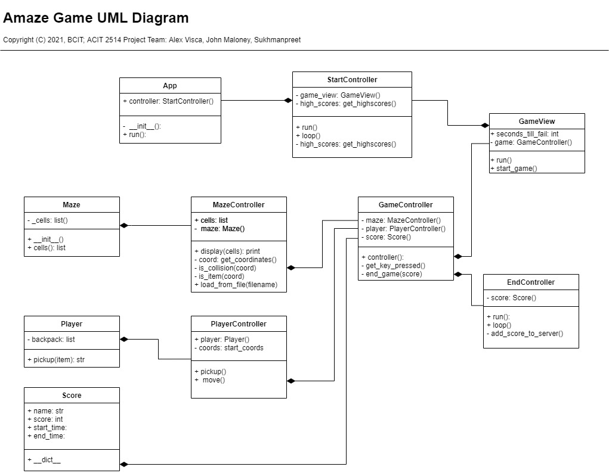

# Maze Game Development Project

## Project Scope
This application aims to create a simple game where a player must solve a maze. The game records a players score, and publishes these scores to a web browser.

## Development Team

Project produced for ACIT2515 Object-Oriented Programming in Python
Group Members|Job Description
------------|------------------------
Alex Visca | Development team leader
John Maloney| Developer, Documentation
Sukhmanpreet| Developer, QA and testing

---
## Getting Started

## **STEP 1**: Start the application server
Start by running `api.py` at `./Web/api.py`

## **STEP 2**: Start the game
Then run `main.py` at ./Maze/main.py

## **STEP 3**: Play the game
Game ruleset:
* The game will request a name. Optional (Defaults to "GUEST")  
* Controls with the arrow keys.  
* Crossing a loot item will automatically collect it and display the number of items in the backpack.  
* ***The player must collect all loot items before reaching the exit***

## **STEP 4**: Repeat and compete
When the game ends, replay by running `./Maze/main.py` again.  
Scores are posted http://localhost:`<port>`/

---
## Gameplay and Features
**Start screen**:  
Requests the player's name. Optional (Defaults to 'GUEST')  
Shows previous players' high scores.  

Press ENTER to continue to the game screen

**Game screen**:  
Player controls:
*   Arrow keys to move
*   ESCAPE to exit  

Map  
*   Cannot pass through brick walls.  
*   All coins are placed randomly, and **must be picked up before using the exit**

Coins and backpack  
*   ***Player must collect all 4 coins before reaching the exit in order to win the game!***  
*   Number of coins collected in the player's backpack is shown in the top left corner of the screen.

Timer  
*   Player muct complete the maze before the timer runs out, otherwise they lose the game.
*   The time it takes for the player to complete the maze is measured to calculate a player score.

## Scores
High scores are accessible by a web browser at http://localhost:`<port>`/.  
Player scores are saved as `./Web/scores.json`

# Application Design

---

## Application Package Contents
Maze Project/
*   Docs/
    *   MazeUML.pdf
    *   MazeUML.jpg
    *   project.md
    *   testplan.md
*   Maze/
    *   controllers/
        *   app.py
        *   end_controller.py
        *   game_controller.py
        *   maze_controller.py
        *   player_controller.py
        *   start_controller.py
    *   models/
        *   maze.py
        *   player.py
        *   score.py
    *   tests/
        *   test_controllers.py
        *   test_models.py
        *   test_views.py
    *   views/
        *   game_view.py
    *   main.py
*   Web/
    *   controllers/
        *   score_manager.py
    *   models/
        *   score.py
    *   templates/
        *   scores.html
    *   api.py
*   README.md

## Development Critique

**Notes**: The architecture of the application *attempts* to apply the pygame library to the Model/View/Controller (MVC) design. This caused some issues in app design and structural flexibility was required to make the pygame library fit into MVC. If an impasse was reached, developers favoured pygame functionality over MVC. This is evident in the duplicated run() and loop() methods in several controllers and a high use of functional programming for fixes after the refactor.  
It was also a challenge to assign certain pygame specific render functions to views because they were necessary for conditions in the game loop, which was duplicated across controllers.

Future iterations may dispense with the PyGame library in favour of supporting libraries with a more MVC-friendly application design.